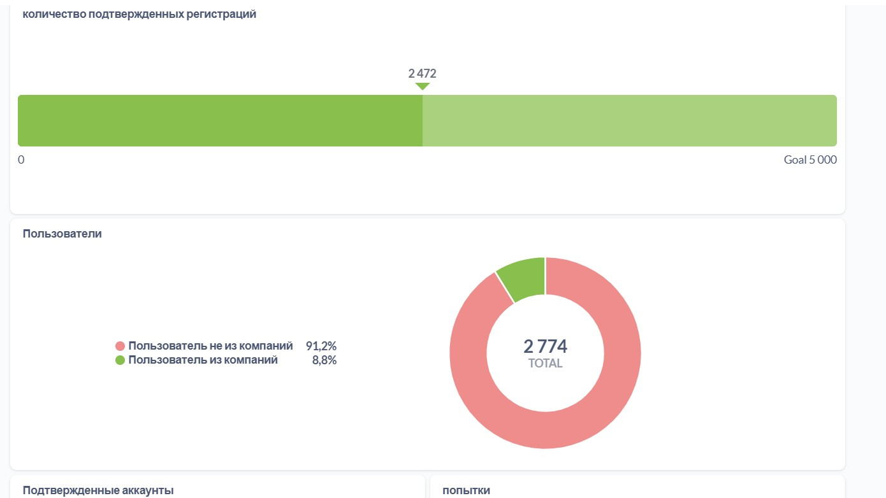
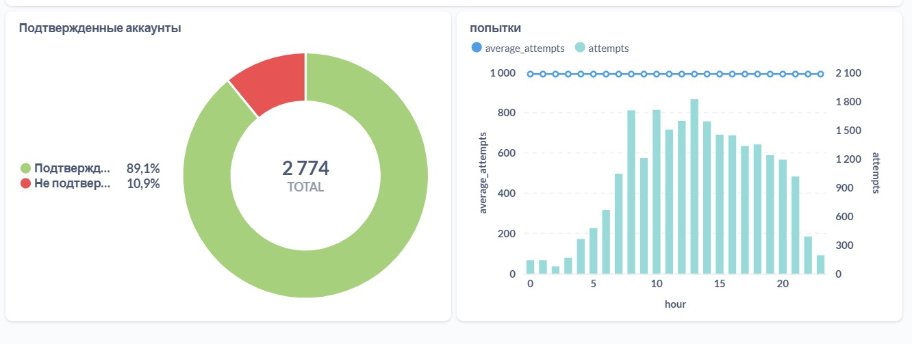
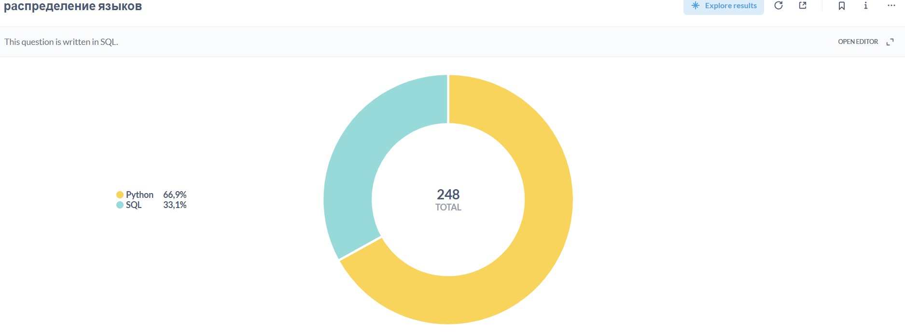

# simulative-sql-practice
# Портфолио Аналитика Данных

Привет! Здесь собраны мои практические работы по анализу данных и автоматизации.

## Проект: Интерактивный дашборд в Metabase
Я разработал дашборд для бизнес-анализа основных показателей проекта.

### Что было сделано:
* Написаны оптимизированные SQL-запросы для подсчета количества подтвержденных регистраций, аккаунтов, пользоватлей и попыток при решении.

### Визуализация дашборда:

